<h1 align="center">🕸️ DBLP SNA Explorer</h1>

<p align="center">
  <strong>Memetakan kolaborasi ilmiah lewat jaringan ko-autoran DBLP.</strong><br>
  Visual essay interaktif — <b>3.000 peneliti</b>, <b>106.054 kolaborasi</b>, <b>3 komunitas riset terbesar</b>.
</p>

<p align="center">
  
  
  
  
  
  
  
  
  
  
</p>

<p align="center">
  
  
  
  
  
</p>

<div align="center">

**Tugas Akhir Analisis Media Sosial · Kelompok 10 · Telkom University**

| Anggota | NIM |
|---|---|
| Almira Faradhita Alifah | 103052330069 |
| Arkhan Falih Fahrie Puspita | 103052330051 |
| Keisha Hernantya Zahra | 103052330063 |

</div>

---

## Daftar Isi

- [🌐 Live Demo](#-live-demo)
- [🎨 Preview Visualisasi](#-preview-visualisasi)
- [✨ Fitur Utama](#-fitur-utama)
- [🧰 Tech Stack](#-tech-stack)
- [📊 Dataset](#-dataset)
- [🔍 Pertanyaan yang Dijawab](#-pertanyaan-yang-dijawab)
- [🎯 Highlights & Temuan Kunci](#-highlights--temuan-kunci)
- [🏆 Top-10 Aktor Sentral](#-top-10-aktor-sentral)
- [🧪 Pipeline & Metodologi](#-pipeline--metodologi)
- [📈 Galeri Analisis](#-galeri-analisis)
- [📁 Struktur Direktori](#-struktur-direktori)
- [🚀 Cara Menjalankan Lokal](#-cara-menjalankan-lokal)
- [☁️ Deployment](#-deployment)
- [📚 Referensi](#-referensi)

---

## 🌐 Live Demo

| URL | Keterangan |
|---|---|
| **Web Visualisasi** | `https://fall-llihc.github.io/SNAP-DBLP/` |
| **Repository** | https://github.com/Fall-Llihc/SNAP-DBLP |

> Deploy via GitHub Pages dengan source `main → /docs`. Aktifkan di **Settings → Pages**.

---

## 🎨 Preview Visualisasi

### Network keseluruhan — `G_3000`

<p align="center">
  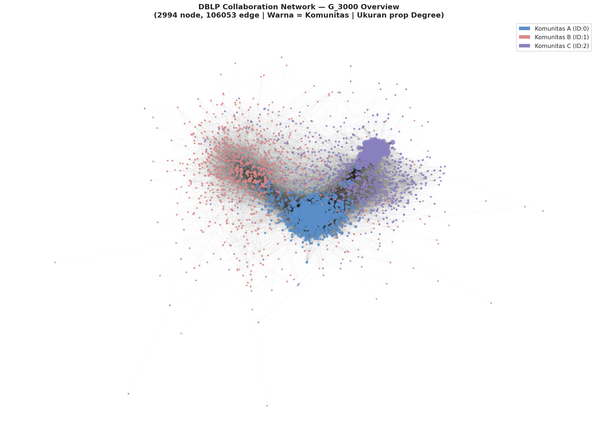
</p>

<p align="center">
  <em>3.000 peneliti, 106.054 kolaborasi, terwarnai per komunitas hasil deteksi Louvain.</em>
</p>

### Per-komunitas — fokus satu kelompok riset sekaligus

<p align="center">
  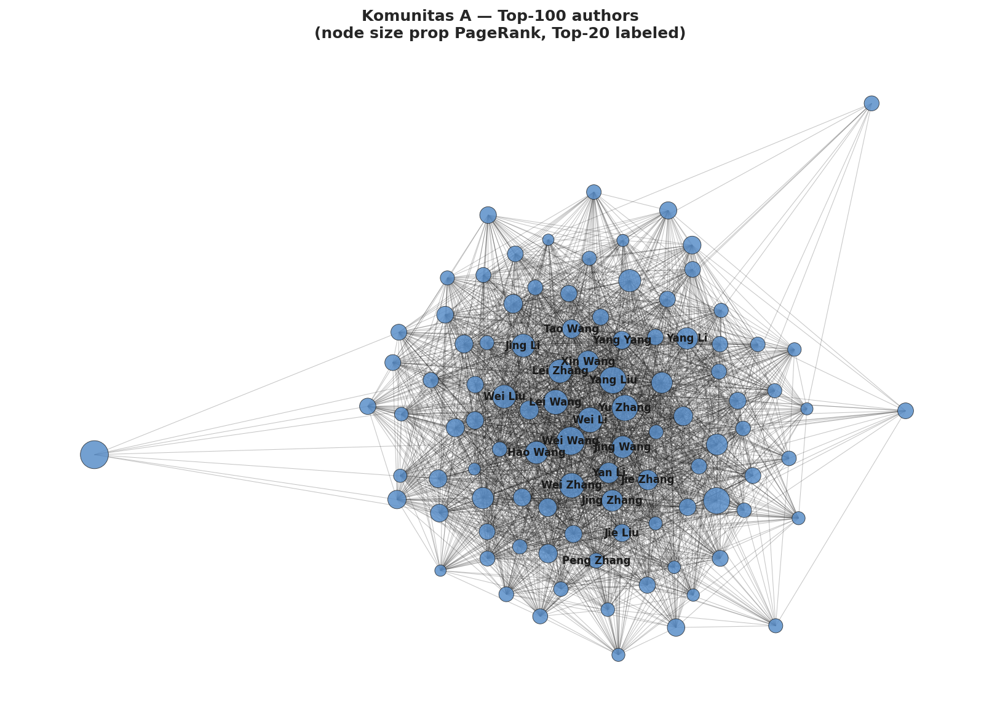
  &nbsp;
  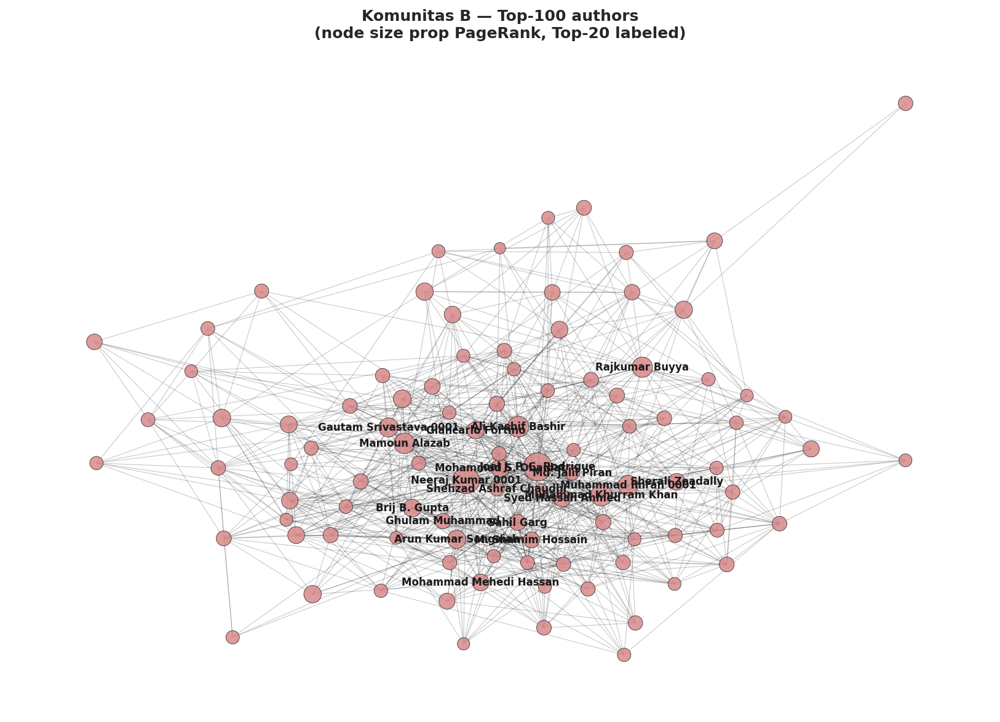
  &nbsp;
  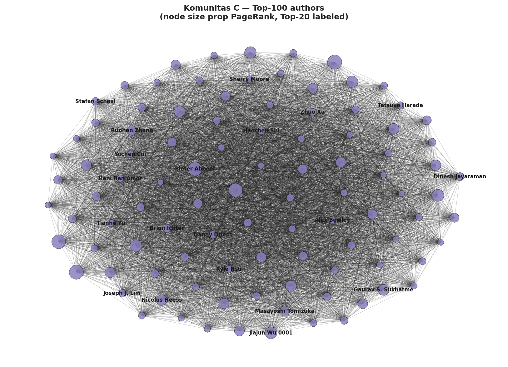
</p>

<table align="center">
  <tr>
    <td align="center"><b>🟦 Komunitas A</b><br>kohesif · banyak <em>broker</em><br><sub>1.000 node · 43.054 edge internal</sub></td>
    <td align="center"><b>🟥 Komunitas B</b><br>terdesentralisasi<br><sub>1.000 node · 8.022 edge internal</sub></td>
    <td align="center"><b>🟪 Komunitas C</b><br>padat · banyak <em>hub</em> lokal<br><sub>1.000 node · 46.630 edge internal</sub></td>
  </tr>
</table>

---

## ✨ Fitur Utama

- **🔍 Network Explorer** — graf canvas dengan filter per-komunitas, pan/zoom, hover highlight neighborhood
- **🏆 Leaderboard** — ranking peneliti by composite score, bisa di-pecah per metrik (DC / BC / CC / PR)
- **📊 Multi-metric Comparison** — *parallel coordinates* untuk membandingkan 4 metrik sentralitas sekaligus
- **🔥 Correlation Heatmap** — Pearson, Spearman, Kendall side-by-side
- **📈 Power-Law Distribution** — CCDF derajat di skala log-log dengan eksponen α = 2,31
- **🌗 Dark Mode** — toggle terang/gelap dengan transisi mulus
- **📱 Responsive** — layout adaptif untuk desktop & tablet
- **⚡ Static Site** — tidak butuh server, bisa deploy gratis di GitHub Pages / Vercel / Cloudflare

---

## 🧰 Tech Stack

### Pipeline Analisis (Python)

| Tool | Peran |
|---|---|
| **NetworkX** | komputasi metrik (degree, betweenness, closeness, PageRank), modularity, ARI |
| **python-louvain** | algoritma deteksi komunitas Louvain |
| **Gephi** | eksplorasi visual & layout *force-directed* (ForceAtlas2) sebagai sanity-check |
| **pandas / NumPy** | manipulasi data & tabel statistik |
| **powerlaw** | fitting eksponen power-law pada CCDF |
| **Matplotlib / Seaborn** | figure analitik di `pic-visualisasi/` |

### Visualisasi Web (Static)

| Tool | Peran |
|---|---|
| **D3.js v7** | force-simulation, scales, axes, parallel coords, heatmap |
| **HTML5 Canvas** | rendering 498-node network explorer (perf > SVG di density tinggi) |
| **Vanilla JS / CSS3** | tanpa framework, tanpa build step — cukup buka `index.html` |

---

## 📊 Dataset

| Atribut | Nilai |
|---|---|
| Sumber | DBLP XML dump resmi (`dblp.org/xml/`) |
| Cakupan | publikasi 2010 – 2024 |
| Node (peneliti) | **3.000** (1.000 per komunitas, top-by-degree) |
| Edge (kolaborasi) | **106.054** |
| Densitas graf | 0,0236 |
| Avg / median / max degree | 70,70 / 37 / **511** (Xi Chen) |
| Disambiguasi nama | DBLP author key (tanpa ORCID) |
| File runtime | `docs/data/network.json` (~3 MB) |

### Statistik per Komunitas

| Komunitas | Node | Edge internal | Avg. Degree | Max. Degree |
|---|---:|---:|---:|---:|
| 🟦 A | 1.000 | 43.054 | 86,11 | 358 |
| 🟥 B | 1.000 | 8.022 | 16,04 | 169 |
| 🟪 C | 1.000 | 46.630 | 93,26 | 344 |

---

## 🔍 Pertanyaan yang Dijawab

> Apa yang ingin di-*answer* oleh project ini?

1. 🎯 **Aktor sentral** — siapa peneliti paling berpengaruh, dan dari sumber pengaruh apa (popularitas / jembatan / kedekatan / prestise) dominasi tersebut berasal?
2. 🧬 **Profil komunitas** — bagaimana karakteristik tiga komunitas terbesar berbeda dilihat dari rata-rata sentralitas anggotanya?
3. 🌉 **Hub vs Broker** — apakah peneliti dengan kolaborator terbanyak otomatis menjadi penghubung antar-komunitas, atau dua peran ini dijalankan aktor yang berbeda?
4. 🌐 **Sifat struktural** — apakah jaringan DBLP memenuhi sifat *small-world* dan *scale-free* yang lazim pada jaringan sosial nyata, dan seberapa kuat struktur komunitasnya?

---

## 🎯 Highlights & Temuan Kunci

| | Temuan |
|---|---|
| 👑 | **Xi Chen** (Komunitas A) menguasai 3 dari 4 metrik (DC, BC, CC) sekaligus — composite score **0,947** |
| 🌉 | **Hub ≠ Broker.** Korelasi DC–BC hanya **0,346** (Pearson). Hanya 57 peneliti (1,9%) merangkap keduanya. |
| 🧬 | **Spesialisasi peran per komunitas:** A → broker & closeness leader · B → prestige · C → 100% hub murni (245/245) |
| 🌐 | **Small-world.** σ = **8,55** (≫ 1) — clustering 11× lebih tinggi daripada graf acak setara |
| 📐 | **Scale-free.** Eksponen power-law α = **2,31**, dalam rentang khas jaringan sosial (2 < α < 3) |
| 🧱 | **Struktur komunitas kuat & stabil.** Q = **0,697**, ARI multi-seed = **0,984** (10 *seed* berbeda) |
| 🪞 | **Outlier ≠ noise.** Selisih korelasi Pearson vs Spearman pada DC–CC dan DC–PR mengungkap distorsi super-hub |

<p align="center">
  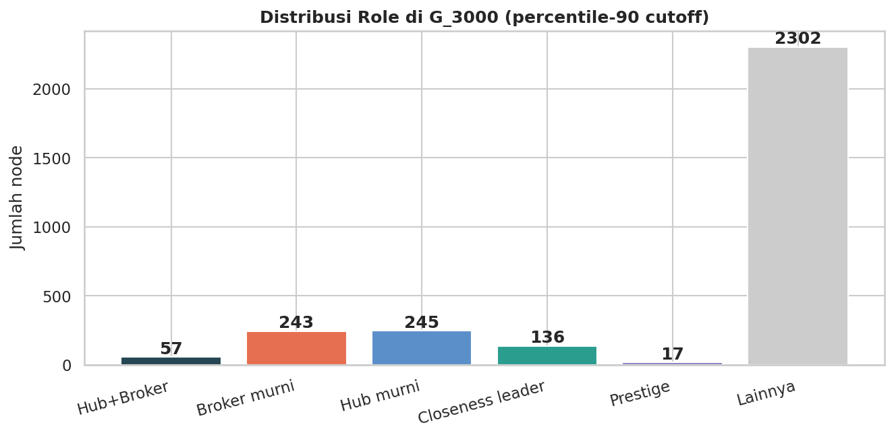
</p>

<p align="center"><sub><em>Distribusi peran di G_3000. Hub murni terkonsentrasi di Komunitas C, broker dominan di Komunitas A.</em></sub></p>

---

## 🏆 Top-10 Aktor Sentral

| # | Peneliti | Komunitas | DC | BC | CC | PR | Composite |
|---:|:---|:---:|---:|---:|---:|---:|---:|
| 🥇 | Xi Chen | 🟦 A | 0,170 | 0,034 | 0,478 | 0,00150 | **0,947** |
| 🥈 | Wei Wang | 🟦 A | 0,125 | 0,008 | 0,471 | 0,00163 | 0,702 |
| 🥉 | Joel J. P. C. Rodrigues | 🟥 B | 0,069 | 0,016 | 0,427 | **0,00189** | 0,688 |
| 4 | Yu Zhang | 🟦 A | 0,112 | 0,008 | 0,470 | 0,00148 | 0,662 |
| 5 | Yang Liu | 🟦 A | 0,118 | 0,005 | 0,463 | 0,00153 | 0,656 |
| 6 | Mohsen Guizani | 🟦 A | 0,067 | 0,016 | 0,435 | 0,00163 | 0,655 |
| 7 | Ying Xu | 🟦 A | 0,125 | 0,014 | 0,448 | 0,00090 | 0,634 |
| 8 | Neeraj Kumar 0001 | 🟥 B | 0,061 | 0,013 | 0,422 | 0,00171 | 0,628 |
| 9 | Wei Li | 🟦 A | 0,108 | 0,005 | 0,466 | 0,00141 | 0,623 |
| 10 | Wei Zhang | 🟦 A | 0,106 | 0,005 | 0,463 | 0,00140 | 0,615 |

> 📌 **Cara baca.** *Xi Chen* dominan karena unggul di tiga metrik. *Joel J. P. C. Rodrigues* dari Komunitas B yang lebih kecil tetap masuk podium berkat **PageRank tertinggi** — pertanda prestise meskipun jumlah kolaborator langsung sedang.

---

## 🧪 Pipeline & Metodologi

```
DBLP XML (2010–2024)
        │
        │  parse + filter
        ▼
Graf ko-autoran lengkap  ───┐
        │                   │
        │  Louvain          │  NetworkX
        ▼                   │
Top-3 komunitas terbesar    │  Gephi (layout & sanity check)
        │                   │
        │  top-1.000 by deg │
        ▼                   │
G_3000 (3.000 × 106.054) ───┘
        │
        ├─► 🎯 4 metrik sentralitas (DC eksak · BC Brandes-k=500 · CC eksak · PR α=0,85)
        ├─► 🧬 klasifikasi peran (hub / broker / closeness leader / prestige)
        ├─► 🌐 uji small-world (σ vs Erdős–Rényi) & power-law (Clauset-Shalizi-Newman)
        ├─► 🧱 modularitas Q & kualitas komunitas (conductance, ρ_in/ρ_ext, ARI multi-seed)
        └─► 📦 export ke docs/data/network.json
                          │
                          ▼
        🌐 Web visualisasi (D3.js + Canvas)
```

**Reprodusibilitas.** `seed = 42` di setiap tahap stokastik (sampling Brandes, init Louvain). Dataset ke-snapshot per `2026-05-25`.

---

## 📈 Galeri Analisis

<table align="center">
  <tr>
    <td align="center" width="50%">
      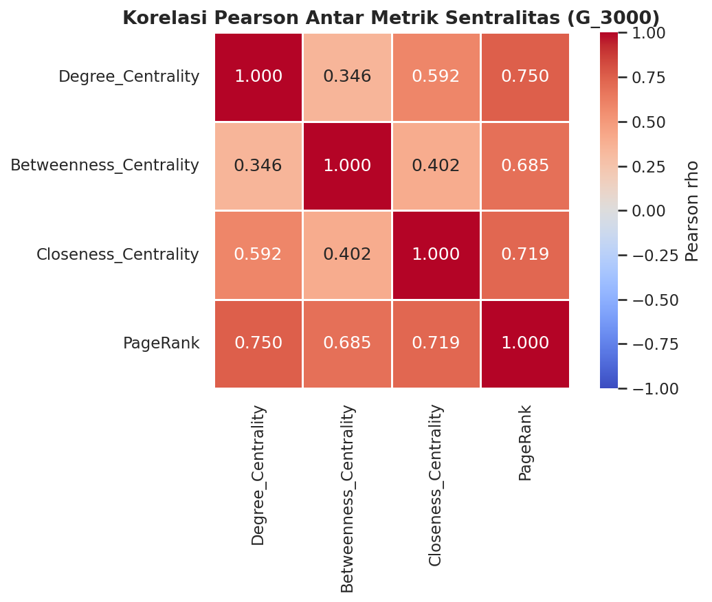<br>
      <sub><b>Korelasi 4 metrik sentralitas</b><br>Pearson — linear correlation</sub>
    </td>
    <td align="center" width="50%">
      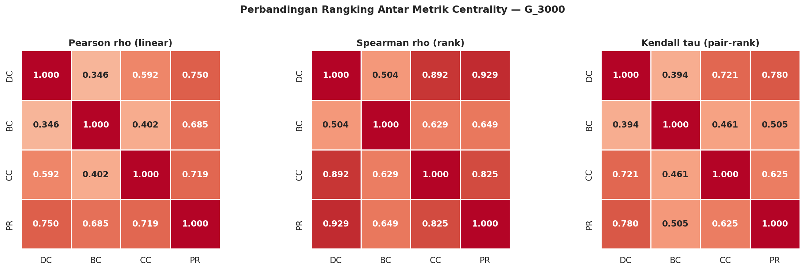<br>
      <sub><b>Pearson · Spearman · Kendall</b><br>Selisih besar = ada outlier (super-hub)</sub>
    </td>
  </tr>
  <tr>
    <td align="center">
      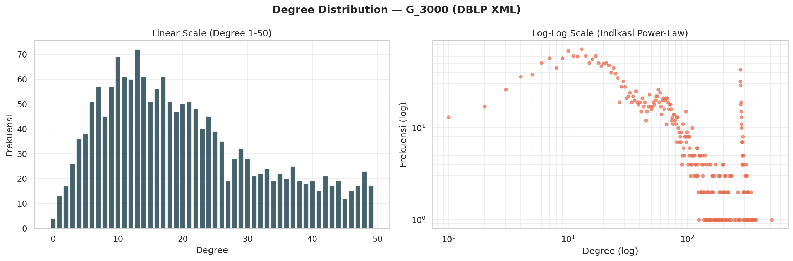<br>
      <sub><b>Distribusi derajat (log–log)</b><br>Power-law α = 2,31</sub>
    </td>
    <td align="center">
      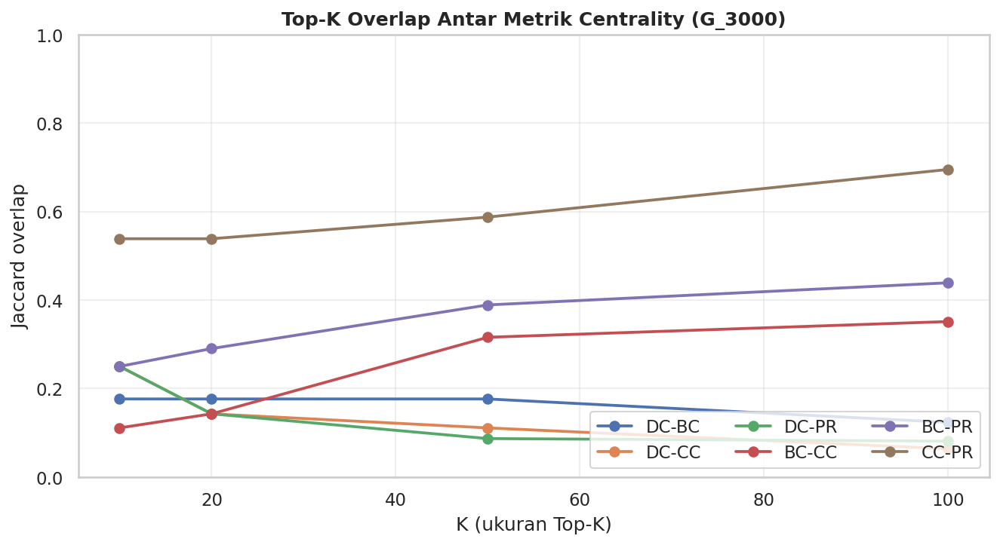<br>
      <sub><b>Tumpang-tindih top-K antar metrik</b><br>CC–PR overlap tertinggi (≈0,7)</sub>
    </td>
  </tr>
  <tr>
    <td align="center">
      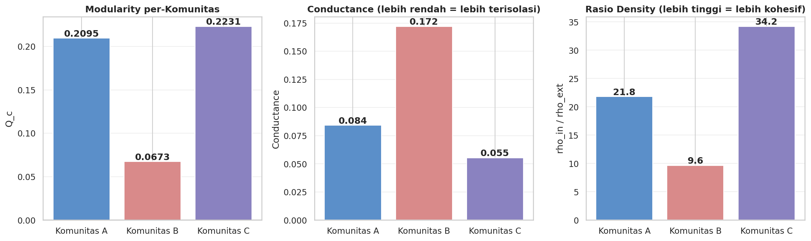<br>
      <sub><b>Kualitas komunitas</b><br>Q_c · conductance · ρ_in/ρ_ext</sub>
    </td>
    <td align="center">
      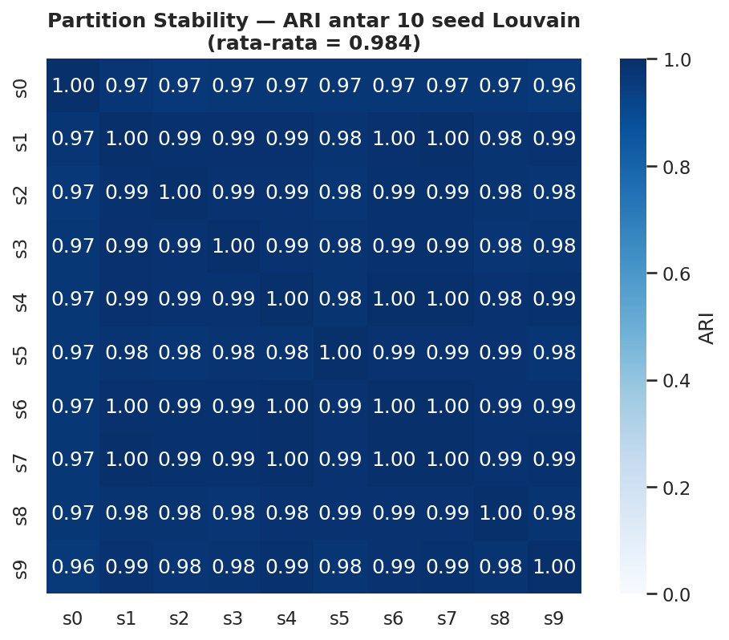<br>
      <sub><b>Stabilitas partisi Louvain</b><br>ARI multi-seed = 0,984</sub>
    </td>
  </tr>
  <tr>
    <td align="center">
      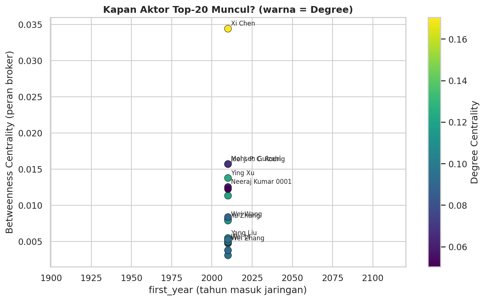<br>
      <sub><b>first_year × Betweenness</b><br>Broker akumulatif lewat waktu</sub>
    </td>
    <td align="center">
      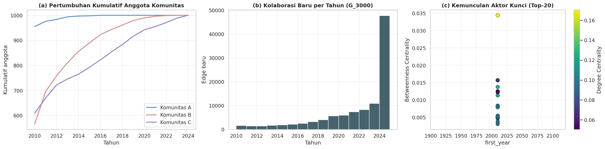<br>
      <sub><b>Pertumbuhan temporal jaringan</b><br>Kumulatif 2010 → 2024</sub>
    </td>
  </tr>
</table>

---

## 📁 Struktur Direktori

```
SNAP-DBLP/
├── docs/                        # 🌐 root yang dideploy (GitHub Pages source)
│   ├── index.html
│   ├── assets/
│   │   ├── app.css              # design system + dark mode
│   │   ├── main.js              # orchestration + theme toggle
│   │   ├── viz-charts.js        # bar / heatmap / scatter / parallel coords / CCDF
│   │   └── viz-graph.js         # Canvas + d3-force network explorer
│   └── data/
│       └── network.json         # data riil hasil pipeline DBLP XML
├── pic-visualisasi/             # 🎨 figure dari notebook (PNG)
├── raw/                         # GEXF mentah (opsional, untuk script konversi)
├── scripts/
│   ├── build_network_json.py    # konversi GEXF → network.json (opsional)
│   └── requirements.txt
├── package.json
└── README.md
```

---

## 🚀 Cara Menjalankan Lokal

> Situs *fully static* — tanpa build step, tanpa `npm install`.

```bash
# Opsi 1 — npx serve (rekomendasi)
npx serve -s docs

# Opsi 2 — Python built-in
python3 -m http.server -d docs 8000
```

Buka `http://localhost:3000` (atau `:8000`).

### Re-generate `network.json` (opsional)

Hanya jika ingin men-trigger ulang pipeline dari GEXF mentah:

```bash
pip install -r scripts/requirements.txt
python scripts/build_network_json.py raw/your-graph.gexf docs/data/network.json
```

---

## ☁️ Deployment

Tiga opsi gratis tanpa kartu kredit:

<table>
<tr><th>Platform</th><th>Konfigurasi</th></tr>
<tr>
  <td><b>🐙 GitHub Pages</b><br><sub>termudah</sub></td>
  <td>Settings → Pages → Source: <code>Deploy from branch</code> → Branch: <code>main</code> · folder: <code>/docs</code></td>
</tr>
<tr>
  <td><b>▲ Vercel</b></td>
  <td>Import repo → Framework: <code>Other</code> · Root: <code>docs</code> · Build command: <em>(kosongkan)</em></td>
</tr>
<tr>
  <td><b>⚡ Cloudflare Pages</b></td>
  <td>Connect to Git → Build command: <em>(kosongkan)</em> · Build output: <code>docs</code></td>
</tr>
</table>

> Karena seluruh data dimuat lewat *relative path* (`data/network.json`), tidak ada *environment variable* yang perlu diset.

---

## 📚 Referensi

- **DBLP** — Computer Science Bibliography. *XML dump*. <https://dblp.org/xml/>
- **Blondel** *et al.* (2008). *Fast unfolding of communities in large networks*. **JSTAT**.
- **Brandes, U.** (2001). *A faster algorithm for betweenness centrality*. **J. Math. Sociology**.
- **Clauset, Shalizi, Newman** (2009). *Power-law distributions in empirical data*. **SIAM Review**.
- **Newman, M. E. J.** (2004). *Coauthorship networks and patterns of scientific collaboration*. **PNAS**.
- **Page, Brin, Motwani, Winograd** (1999). *The PageRank citation ranking*. **Stanford InfoLab**.
- **Watts & Strogatz** (1998). *Collective dynamics of small-world networks*. **Nature**.
- [NetworkX](https://networkx.org/) · [Gephi](https://gephi.org/) · [D3.js](https://d3js.org/) · [python-louvain](https://python-louvain.readthedocs.io/) · [powerlaw](https://pypi.org/project/powerlaw/)

---

<div align="center">

**Kelompok 10 · Analisis Media Sosial · Telkom University · 2026**

<sub>Built with NetworkX 🐍 + Gephi 🎨 + D3.js 📊 — without a build step.</sub>

</div>
