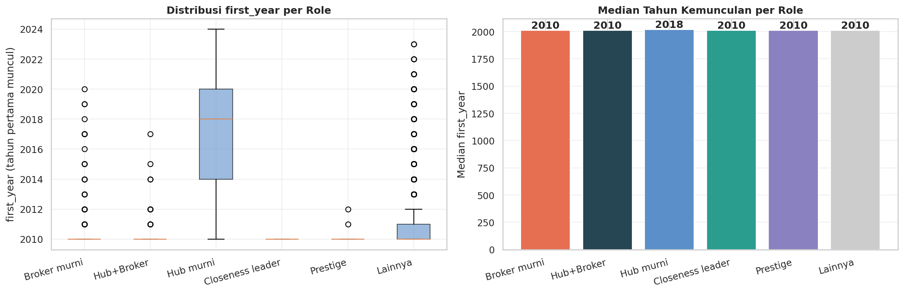

# Memetakan Kolaborasi Ilmiah: Analisis Jaringan Ko-Autoran DBLP

**Tugas Akhir Mata Kuliah Analisis Media Sosial — Kelompok 10**
Telkom University, Semester Genap 2025/2026

> Studi jaringan sosial atas data ko-autoran *Digital Bibliography & Library
> Project* (DBLP) periode 2010–2024, dengan fokus pada tiga komunitas riset
> terbesar (3.000 peneliti, 106.054 kolaborasi). Analisis dilengkapi
> visualisasi interaktif berbasis web yang dapat diakses publik.

---

## Daftar Isi

1. [Abstrak](#1-abstrak)
2. [Latar Belakang](#2-latar-belakang)
3. [Rumusan Masalah](#3-rumusan-masalah)
4. [Tujuan Penelitian](#4-tujuan-penelitian)
5. [Dataset](#5-dataset)
6. [Metodologi](#6-metodologi)
7. [Hasil Analisis](#7-hasil-analisis)
8. [Kesimpulan](#8-kesimpulan)
9. [Visualisasi Web](#9-visualisasi-web)
10. [Struktur Repositori](#10-struktur-repositori)
11. [Cara Menjalankan](#11-cara-menjalankan)
12. [Deploy](#12-deploy)
13. [Tim Penulis](#13-tim-penulis)
14. [Referensi](#14-referensi)

---

## 1. Abstrak

Penelitian ini menelaah struktur jaringan ko-autoran ilmiah pada tiga
komunitas riset terbesar DBLP periode 2010–2024 melalui pendekatan *Social
Network Analysis* (SNA). Jaringan terdiri atas 3.000 simpul (peneliti) dan
106.054 sisi (kolaborasi), dengan densitas global 0,0236. Empat metrik
sentralitas — *degree*, *betweenness*, *closeness*, dan *PageRank* —
digunakan untuk mengidentifikasi aktor sentral, dilanjutkan dengan kategorisasi
peran (hub, broker, *closeness leader*, dan *prestige*) berdasarkan ambang
distribusi metrik. Hasil pengujian struktural menunjukkan bahwa jaringan
bersifat *small-world* (σ = 8,55) sekaligus *scale-free* (eksponen
power-law α = 2,31), dengan modularitas Q = 0,697 yang mengonfirmasi
keberadaan struktur komunitas yang kuat. Skor komposit menempatkan **Xi
Chen** (Komunitas A) sebagai aktor paling sentral di seluruh jaringan,
sementara **Joel J. P. C. Rodrigues** dan **Mohsen Guizani** menonjol
sebagai jembatan antar-komunitas.

---

## 2. Latar Belakang

Kolaborasi ilmiah merupakan salah satu wujud paling konkret dari interaksi
sosial di dunia akademik: setiap karya bersama meninggalkan jejak
ko-autoran yang dapat direkonstruksi menjadi sebuah jaringan. DBLP, sebagai
salah satu basis data bibliografi terbesar di bidang ilmu komputer,
menyediakan *raw material* yang ideal untuk studi jaringan tersebut karena
cakupannya yang luas dan ketersediaannya dalam format XML terbuka.

Namun, jaringan ko-autoran berskala penuh DBLP berisi jutaan node, terlalu
besar untuk dianalisis secara komprehensif dalam ruang lingkup tugas akhir.
Oleh karena itu, penelitian ini mempersempit fokus pada **tiga komunitas
riset terbesar** hasil deteksi komunitas algoritma *Louvain* dengan masing-
masing 1.000 peneliti, sehingga total jaringan terdiri atas 3.000 node dan
106.054 edge kolaborasi. Penyederhanaan ini tetap mempertahankan struktur
multi-komunitas dan keberadaan *broker* antar-komunitas, dua hal yang
menjadi inti analisis.

---

## 3. Rumusan Masalah

Penelitian ini menjawab empat pertanyaan utama:

1. **Aktor sentral.** Siapa peneliti paling berpengaruh dalam jaringan
   ko-autoran DBLP 2010–2024, dan dari sumber pengaruh apa (popularitas,
   peran jembatan, kedekatan, atau prestise) dominasi tersebut berasal?
2. **Profil komunitas.** Bagaimana karakteristik tiga komunitas riset
   terbesar berbeda satu sama lain dilihat dari rata-rata sentralitas
   anggotanya, dan mengapa perbedaan tersebut muncul?
3. **Hub vs broker.** Apakah peneliti dengan jumlah kolaborator terbanyak
   (*hub*) otomatis menjadi penghubung antar-komunitas (*broker*), atau
   kedua peran tersebut dijalankan oleh aktor yang berbeda?
4. **Sifat struktural.** Apakah jaringan ko-autoran DBLP memenuhi sifat
   *small-world* dan *scale-free* yang lazim dijumpai pada jaringan sosial
   nyata, dan seberapa kuat struktur komunitas yang terbentuk?

---

## 4. Tujuan Penelitian

Sejalan dengan rumusan masalah di atas, penelitian ini bertujuan untuk:

1. Mengidentifikasi 15 peneliti paling sentral berdasarkan skor komposit
   empat metrik sentralitas, dan mendekomposisi skor tersebut untuk
   menjelaskan sumber pengaruh masing-masing aktor.
2. Memetakan profil sentralitas rata-rata per komunitas untuk
   mengkarakterisasi perbedaan struktural antar komunitas A, B, dan C.
3. Memisahkan peran *hub* dan *broker* melalui diagram pencar
   *degree* × *betweenness*, kemudian menghitung distribusi peran (Hub
   murni, Broker murni, Hub+Broker, *Closeness leader*, *Prestige*,
   Lainnya) di seluruh jaringan.
4. Menguji sifat *small-world* (koefisien σ) dan *scale-free* (estimasi
   eksponen power-law α) jaringan, serta mengukur modularitas Q sebagai
   bukti struktur komunitas.
5. Mengomunikasikan hasil dalam bentuk *visual essay* berbasis web yang
   dapat diakses publik.

---

## 5. Dataset

| Atribut | Nilai |
|---|---|
| Sumber | DBLP XML dump resmi (`dblp.org/xml/`) |
| Cakupan tahun publikasi | 2010 – 2024 |
| Jumlah peneliti (node) | 3.000 (1.000 per komunitas, top-1.000 by *degree*) |
| Jumlah kolaborasi (edge) | 106.054 |
| Densitas graf | 0,0236 |
| Rata-rata derajat | 70,70 |
| Median derajat | 37 |
| Derajat maksimum | 511 (Xi Chen) |
| Disambiguasi nama | berdasarkan *author key* DBLP (tanpa ORCID) |

**Catatan keterbatasan data.** DBLP XML tidak melakukan *name
disambiguation* berbasis ORCID, sehingga dua peneliti berbeda dengan nama
identik berpotensi tergabung sebagai satu node. Selain itu, rentang
observasi dibatasi mulai 2010 (`YEAR_MIN = 2010`), sehingga setiap penulis
yang sudah aktif sebelum tahun tersebut otomatis tercatat memiliki
`first_year = 2010` (efek *left-censoring*).

### 5.1 Statistik per Komunitas (Subgraf Terinduksi)

| Komunitas | Node | Edge internal | Avg. Degree | Max. Degree |
|---|---:|---:|---:|---:|
| A | 1.000 | 43.054 | 86,11 | 358 |
| B | 1.000 |  8.022 | 16,04 | 169 |
| C | 1.000 | 46.630 | 93,26 | 344 |

Komunitas A dan C jauh lebih padat secara internal dibandingkan
Komunitas B. Pola ini akan tampak konsisten pada profil sentralitas dan
kualitas komunitas (lihat Bagian 7).

---

## 6. Metodologi

### 6.1 Pipeline Analisis

```
DBLP XML (2010-2024)
        │
        │  parsing + filtering
        ▼
Graf ko-autoran lengkap
        │
        │  Louvain community detection
        ▼
Top-3 komunitas terbesar
        │
        │  sampling top-1.000 per komunitas (by degree)
        ▼
G_3000 (3.000 node, 106.054 edge)
        │
        ├─► 4 metrik sentralitas (DC, BC, CC, PR)
        ├─► role classification (hub / broker / dst.)
        ├─► uji small-world (σ) & power-law (α)
        ├─► modularitas Q & kualitas komunitas
        └─► export JSON ke docs/data/network.json
```

### 6.2 Metrik Sentralitas

| Metrik | Interpretasi | Komputasi |
|---|---|---|
| **Degree Centrality (DC)** | Banyaknya kolaborator langsung — mengukur popularitas. | Eksak (`networkx.degree_centrality`). |
| **Betweenness (BC)** | Frekuensi node berada pada jalur terpendek antar-pasangan node — mengukur peran jembatan. | Aproksimasi Brandes dengan k = 500 sumber sampel. |
| **Closeness (CC)** | Kebalikan rata-rata jarak ke seluruh node lain — mengukur kedekatan global. | Eksak. |
| **PageRank (PR)** | Pengaruh yang menyebar lewat tetangga berpengaruh — mengukur prestise. | Iteratif, *damping factor* α = 0,85. |

Reprodusibilitas dijaga dengan menetapkan `seed = 42` pada setiap tahap
yang melibatkan stokastisitas (sampling Brandes, inisialisasi Louvain).

### 6.3 Klasifikasi Peran

Klasifikasi peran mengikuti aturan ambang berbasis kuantil distribusi
metrik dalam G_3000:

- **Hub murni** — DC tinggi, BC rendah (aktor populer di komunitasnya).
- **Broker murni** — BC tinggi, DC rendah (jembatan antar-komunitas).
- **Hub + Broker** — DC dan BC sama-sama tinggi.
- **Closeness leader** — CC tinggi tanpa dominasi pada metrik lain.
- **Prestige** — PR tinggi tanpa dominasi pada metrik lain.
- **Lainnya** — tidak menonjol di metrik manapun.

### 6.4 Uji Sifat Jaringan

- **Small-world** — koefisien σ = (C_obs/C_rand) / (L_obs/L_rand)
  dibandingkan terhadap graf acak Erdős–Rényi setara. Ambang σ > 1
  menandakan jaringan *small-world*.
- **Scale-free** — fitting power-law pada CCDF distribusi derajat dengan
  prosedur Clauset, Shalizi, & Newman (2009).
- **Modularitas** — Q dihitung pada *largest connected component*; ambang
  Q > 0,3 lazim diinterpretasikan sebagai bukti struktur komunitas yang
  nyata.
- **Stabilitas partisi** — diuji dengan *Adjusted Rand Index* (ARI)
  multi-seed (10 *seed*).

---

## 7. Hasil Analisis

### 7.1 Profil Komunitas dan Sentralitas Rata-Rata

| Komunitas | avgDeg | avgDegN | avgBC | avgCC | avgPR |
|:---|---:|---:|---:|---:|---:|
| A | 94,01 | 0,184 | 0,0010 | 0,406 | 0,00046 |
| B | 19,38 | 0,038 | 0,0004 | 0,327 | 0,00024 |
| C | 98,72 | 0,193 | 0,0004 | 0,356 | 0,00030 |

**Temuan utama.** Komunitas A dan C jauh lebih intensif berkolaborasi
dibandingkan B. Komunitas A menonjol pada *betweenness* dan *closeness*,
sementara C menonjol pada *degree*. Komunitas B berperan sebagai
"penampung" bagi sebagian *broker* prestisius (lihat Bagian 7.3).

<p align="center">
  
  <br>
  <em>Gambar 1. Visualisasi gabungan G_3000 (3.000 peneliti × 3 komunitas).</em>
</p>

<p align="center">
  
  
  
  <br>
  <em>Gambar 2. Subgraf per komunitas: A (kiri), B (tengah), C (kanan). A dan C
  tampak padat dengan beberapa super-hub; B lebih terdesentralisasi.</em>
</p>

### 7.2 Top-15 Aktor Berpengaruh (Composite Score)

| Peringkat | Peneliti | Komunitas | DC | BC | CC | PR | Composite |
|---:|:---|:---:|---:|---:|---:|---:|---:|
| 1  | Xi Chen | A | 0,170 | 0,0344 | 0,478 | 0,00150 | **0,947** |
| 2  | Wei Wang | A | 0,125 | 0,0081 | 0,471 | 0,00163 | 0,702 |
| 3  | Joel J. P. C. Rodrigues | B | 0,069 | 0,0157 | 0,427 | 0,00189 | 0,688 |
| 4  | Yu Zhang | A | 0,112 | 0,0079 | 0,470 | 0,00148 | 0,662 |
| 5  | Yang Liu | A | 0,118 | 0,0055 | 0,463 | 0,00153 | 0,656 |
| 6  | Mohsen Guizani | A | 0,067 | 0,0157 | 0,435 | 0,00163 | 0,655 |
| 7  | Ying Xu | A | 0,125 | 0,0138 | 0,448 | 0,00090 | 0,634 |
| 8  | Neeraj Kumar 0001 | B | 0,061 | 0,0125 | 0,422 | 0,00171 | 0,628 |
| 9  | Wei Li | A | 0,108 | 0,0049 | 0,466 | 0,00141 | 0,623 |
| 10 | Wei Zhang | A | 0,106 | 0,0047 | 0,463 | 0,00140 | 0,615 |
| 11 | Lei Wang | A | 0,106 | 0,0049 | 0,459 | 0,00139 | 0,612 |
| 12 | Ning Liu | A | 0,121 | 0,0113 | 0,443 | 0,00083 | 0,598 |
| 13 | Lei Zhang | A | 0,101 | 0,0052 | 0,455 | 0,00131 | 0,594 |
| 14 | Li Zhang | A | 0,088 | 0,0084 | 0,464 | 0,00123 | 0,594 |
| 15 | Wei Liu | A | 0,098 | 0,0049 | 0,458 | 0,00130 | 0,589 |

**Xi Chen** (Komunitas A) mendominasi dengan skor komposit 0,947 — bukan
hanya peneliti dengan *degree* tertinggi (0,170), tetapi juga *betweenness*
tertinggi di seluruh jaringan (0,034). Sebaliknya, **Joel J. P. C.
Rodrigues** (peringkat 3) berasal dari Komunitas B yang lebih kecil, tetapi
tertarik ke papan atas oleh PageRank tertinggi (0,00189), menandai
prestise/sitasi tinggi meskipun jumlah kolaborator langsungnya sedang.

### 7.3 Distribusi Peran (Role)

| Peran | Total | A | B | C |
|:---|---:|---:|---:|---:|
| Lainnya | 2.302 | 668 | 931 | 703 |
| Hub murni | 245 | 0 | 0 | 245 |
| Broker murni | 243 | 156 | 66 | 21 |
| Closeness leader | 136 | 136 | 0 | 0 |
| Hub + Broker | 57 | 26 | 0 | 31 |
| Prestige | 17 | 14 | 3 | 0 |

<p align="center">
  
  <br>
  <em>Gambar 3. Distribusi peran di G_3000.</em>
</p>

**Temuan utama.** Peran terdistribusi secara sangat tidak merata di antara
komunitas. *Closeness leader* eksklusif berada di Komunitas A (136/136),
*hub murni* eksklusif di Komunitas C (245/245), sedangkan *broker* paling
banyak juga berasal dari Komunitas A (156/243). Komunitas B menjadi
"penampung" bagi 3 dari 17 peneliti *prestige*, meskipun mayoritas
anggotanya tergolong "Lainnya" (931/1.000). Pola ini mengindikasikan
**spesialisasi struktural per komunitas**: A bertindak sebagai inti
kohesif yang juga banyak menjembatani, C sebagai mesh padat dengan banyak
hub lokal, dan B sebagai komunitas terdesentralisasi dengan beberapa figur
prestisius.

### 7.4 Hub vs Broker

Pemisahan peran *hub* dan *broker* dilakukan dengan mengeplot *degree*
ternormalisasi (sumbu x) terhadap *betweenness* (sumbu y). Korelasi
keduanya hanya **r = 0,346** (Pearson) — relatif lemah — sehingga keduanya
benar-benar mengukur dimensi pengaruh yang berbeda.

<p align="center">
  
  <br>
  <em>Gambar 4. Scatter first_year × betweenness centrality. Aktor yang
  paling tua di jaringan cenderung memiliki betweenness yang lebih tinggi,
  konsisten dengan akumulasi peran broker melalui waktu.</em>
</p>

Hanya **57 peneliti** (1,9%) yang memenuhi kedua peran sekaligus
(Hub+Broker). Aktor-aktor inilah yang paling kritis bila dihilangkan dari
jaringan, karena bukan saja kehilangan banyak edge langsung, tetapi juga
memutus jalur antar-komunitas.

### 7.5 Korelasi Antar Metrik Sentralitas

**Pearson (linear):**

|  | DC | BC | CC | PR |
|:---|---:|---:|---:|---:|
| DC | 1,000 | 0,346 | 0,592 | 0,750 |
| BC | 0,346 | 1,000 | 0,402 | 0,685 |
| CC | 0,592 | 0,402 | 1,000 | 0,719 |
| PR | 0,750 | 0,685 | 0,719 | 1,000 |

**Spearman (peringkat):**

|  | DC | BC | CC | PR |
|:---|---:|---:|---:|---:|
| DC | 1,000 | 0,504 | 0,892 | 0,929 |
| BC | 0,504 | 1,000 | 0,629 | 0,649 |
| CC | 0,892 | 0,629 | 1,000 | 0,825 |
| PR | 0,929 | 0,649 | 0,825 | 1,000 |

<p align="center">
  
  <br>
  <em>Gambar 5. Heatmap korelasi antar empat metrik sentralitas.</em>
</p>

<p align="center">
  
  <br>
  <em>Gambar 6. Tiga jenis korelasi (Pearson, Spearman, Kendall) berdampingan.
  Perbedaan kontras antara Pearson (linear) dan Spearman (peringkat)
  mengungkap pengaruh outlier — terutama pada pasangan DC–CC dan DC–PR.</em>
</p>

**Temuan utama.** Pasangan **DC–PR** (Pearson r = 0,750, Spearman ρ =
0,929) dan **DC–CC** (r = 0,592, ρ = 0,892) menunjukkan kenaikan korelasi
yang besar saat berpindah dari Pearson ke Spearman, tanda kuat adanya
*outlier* (super-hub) yang mendistorsi hubungan linear. Sebaliknya,
pasangan **BC–DC** tetap rendah pada kedua metrik korelasi, menegaskan
bahwa peran *bridge* tidak otomatis sejalan dengan popularitas.

<p align="center">
  
  <br>
  <em>Gambar 7. Tumpang-tindih top-K antar metrik (Jaccard). Pasangan
  CC–PR memiliki overlap tertinggi (≈0,7 pada K=100), sedangkan DC–BC
  paling rendah.</em>
</p>

### 7.6 Sifat Small-World dan Scale-Free

| Indikator | G_3000 | Graf acak setara |
|:---|---:|---:|
| Coefficient clustering (C) | 0,2615 | 0,0237 |
| Average shortest path (L) | 2,7828 | 2,1594 |
| **σ = (C/C_rand) / (L/L_rand)** | **8,55** | (1) |

Karena σ ≫ 1, jaringan ko-autoran DBLP yang dianalisis bersifat
**small-world**. Clustering jauh lebih tinggi daripada graf acak sambil
mempertahankan jarak rata-rata yang tetap pendek — kombinasi yang khas pada
jaringan sosial nyata (Watts & Strogatz, 1998).

Estimasi eksponen power-law pada CCDF distribusi derajat memberikan **α =
2,31** (`xmin = 6`), berada dalam rentang khas jaringan sosial *scale-free*
(2 < α < 3).

<p align="center">
  
  <br>
  <em>Gambar 8. Distribusi derajat dalam skala log-log; ekor distribusi
  konsisten dengan power-law α = 2,31.</em>
</p>

### 7.7 Modularitas dan Kualitas Komunitas

| Komunitas | Q_c | Conductance (φ) | ρ_in/ρ_ext |
|:---|---:|---:|---:|
| A | 0,2095 | 0,0841 | 21,81 |
| B | 0,0673 | 0,1720 |  9,64 |
| C | 0,2231 | 0,0553 | 34,21 |
| **Q (LCC)** | **0,6972** | — | — |

Modularitas Q = 0,697 pada komponen terhubung terbesar berada jauh di atas
ambang Q = 0,3 yang umum dipakai sebagai indikator struktur komunitas
nyata. *Conductance* terendah (0,0553) dan rasio rapat kepadatan
internal/eksternal tertinggi (34,21) keduanya milik Komunitas C — komunitas
paling "tertutup" secara struktural.

Stabilitas partisi diuji multi-seed (10 *seed*) menggunakan ARI:
**rata-rata = 0,9839, min = 0,9635, max = 0,9990**. Artinya hasil
deteksi komunitas Louvain sangat konsisten dan tidak sekadar artefak satu
*seed* tertentu.

<p align="center">
  
  <br>
  <em>Gambar 9. Tiga panel kualitas komunitas: Q_c, conductance, dan rasio
  rho_in/rho_ext per komunitas.</em>
</p>

<p align="center">
  
  <br>
  <em>Gambar 10. Stabilitas partisi Louvain antar-seed (ARI). Hampir semua
  pasangan seed berada di atas 0,96.</em>
</p>

### 7.8 Distribusi `first_year` per Role

| Role | n | min | median | mean | max |
|:---|---:|---:|---:|---:|---:|
| Broker murni | 243 | 2010 | 2010 | 2010,56 | 2020 |
| Closeness leader | 136 | 2010 | 2010 | 2010,00 | 2010 |
| Hub murni | 245 | 2010 | 2018 | 2017,27 | 2024 |
| Hub+Broker | 57 | 2010 | 2010 | 2010,61 | 2017 |
| Lainnya | 2.302 | 2010 | 2010 | 2010,93 | 2023 |
| Prestige | 17 | 2010 | 2010 | 2010,18 | 2012 |

<p align="center">
  
  <br>
  <em>Gambar 11. Distribusi first_year per peran. Hub murni cenderung
  pendatang baru (median 2018), sedangkan broker dan closeness leader
  hampir seluruhnya peneliti yang sudah aktif sejak 2010.</em>
</p>

**Catatan metodologis.** Median `first_year = 2010` pada banyak peran
sebagian besar mencerminkan batas observasi (`YEAR_MIN = 2010`), bukan
murni bukti bahwa peneliti tersebut benar-benar memulai karier pada tahun
itu (efek *left-censoring*). Sebaliknya, kategori *Hub murni* dengan
median 2018 menjadi sinyal yang lebih kuat: peran *hub* tampaknya bisa
diraih lebih cepat daripada peran *broker* dan *closeness leader*, yang
membutuhkan akumulasi koneksi lintas waktu.

<p align="center">
  
  <br>
  <em>Gambar 12. Pertumbuhan temporal jaringan (kumulatif).</em>
</p>

---

## 8. Kesimpulan

Sembilan temuan utama dari penelitian ini adalah:

1. **Skala dan kepadatan.** Jaringan ko-autoran DBLP 2010–2024 untuk tiga
   komunitas terbesar terdiri atas 3.000 peneliti dengan 106.054 kolaborasi
   (densitas 0,0236).
2. **Komunitas tidak homogen.** Komunitas A dan C berkolaborasi jauh lebih
   intensif (avg. degree 86–93) dibanding Komunitas B (16,04), meski
   ukuran ketiganya sama (1.000 peneliti).
3. **Aktor paling sentral.** *Xi Chen* mendominasi seluruh jaringan dengan
   skor komposit 0,947, menjuarai DC, BC, dan CC sekaligus.
4. **Hub ≠ Broker.** Korelasi DC–BC hanya 0,346 (Pearson); peran hub dan
   broker dijalankan oleh aktor yang berbeda di sebagian besar kasus —
   hanya 57 peneliti (1,9%) merangkap keduanya.
5. **Spesialisasi peran per komunitas.** Komunitas A mendominasi peran
   *broker* dan *closeness leader*; Komunitas C menjadi rumah seluruh
   *hub murni*; Komunitas B berkontribusi terutama lewat figur *prestige*.
6. **Small-world.** σ = 8,55 (≫ 1) menegaskan jaringan ini *small-world*
   sesuai kriteria Watts–Strogatz.
7. **Scale-free.** Eksponen power-law α = 2,31 berada dalam rentang khas
   jaringan sosial *scale-free*.
8. **Struktur komunitas kuat dan stabil.** Modularitas Q = 0,697 jauh di
   atas ambang 0,3, dan ARI multi-seed = 0,9839 mengonfirmasi stabilitas
   partisi.
9. **Pengaruh outlier pada interpretasi metrik.** Selisih besar antara
   korelasi Pearson dan Spearman pada pasangan DC–PR dan DC–CC menandakan
   bahwa beberapa super-hub mendistorsi hubungan linear; analisis berbasis
   peringkat lebih tahan terhadap distorsi ini.

---

## 9. Visualisasi Web

Seluruh hasil di atas dikemas ke dalam *visual essay* berbasis web (HTML +
CSS + D3.js v7) yang dapat dijelajahi secara interaktif: graf kolaborasi
yang dapat di-pan/zoom, filter per komunitas, pencarian peneliti,
*leaderboard* terurai per metrik, *parallel coordinates* untuk perbandingan
metrik, *heatmap* korelasi, hingga distribusi derajat skala log-log.
Tersedia juga mode terang/gelap.

<p align="center">
  <em>Tangkapan layar visualisasi (mode gelap):</em><br>
  <em>Mode "Semua komunitas" — peta keseluruhan 498 peneliti paling
  terhubung dari G_3000.</em>
</p>

---

## 10. Struktur Repositori

```
SNAP-DBLP/
├── docs/                        # root yang dideploy
│   ├── index.html
│   ├── favicon.* / icon-* / site.webmanifest
│   ├── assets/
│   │   ├── app.css              # design system & dark mode
│   │   ├── main.js              # orchestration & dark mode toggle
│   │   ├── viz-charts.js        # bar / heatmap / scatter / parallel coords / CCDF
│   │   └── viz-graph.js         # canvas + d3-force network explorer
│   └── data/
│       └── network.json         # data riil hasil pipeline DBLP XML
├── pic-visualisasi/             # gambar hasil notebook (PNG)
├── raw/                         # tempat GEXF mentah (opsional)
├── scripts/
│   ├── build_network_json.py    # konversi GEXF -> network.json (opsional)
│   └── requirements.txt
├── package.json
└── README.md
```

---

## 11. Cara Menjalankan

Situs bersifat *static*, tidak memerlukan *build step*.

```bash
# opsi 1: serve via npm (rekomendasi)
npx serve -s docs

# opsi 2: server bawaan Python
python3 -m http.server -d docs 8000
```

Buka `http://localhost:3000` (atau `:8000`) di peramban.

---

## 12. Deploy

Tiga opsi gratis tanpa kartu kredit:

### Opsi A — GitHub Pages (paling sederhana)

1. Push repo ke GitHub.
2. **Settings → Pages → Source: Deploy from a branch → Branch: `main`,
   folder: `/docs` → Save**.
3. URL akan muncul di halaman yang sama
   (`https://<username>.github.io/<repo>/`).

### Opsi B — Vercel

1. **vercel.com → Add New → Project → Import** dari GitHub.
2. *Framework Preset*: **Other**, *Root Directory*: **docs**, *Build
   Command*: kosongkan.

### Opsi C — Cloudflare Pages

1. **Workers & Pages → Create → Pages → Connect to Git**.
2. *Build command*: kosongkan, *Build output directory*: **docs**.

Karena situs *fully static* dan memuat `data/network.json` secara relatif,
ketiganya bekerja tanpa konfigurasi *environment variable*.

---

## 13. Tim Penulis

| Nama | NIM |
|:---|:---|
| Almira Faradhita Alifah | 103052330069 |
| Arkhan Falih Fahrie Puspita | 103052330051 |
| Keisha Hernantya Zahra | 103052330063 |

**Mata kuliah:** Analisis Media Sosial
**Kelompok:** 10
**Program studi:** S1 Sains Data, Telkom University

---

## 14. Referensi

1. Brandes, U. (2001). *A faster algorithm for betweenness centrality*.
   Journal of Mathematical Sociology, 25(2), 163–177.
2. Clauset, A., Shalizi, C. R., & Newman, M. E. J. (2009). *Power-law
   distributions in empirical data*. SIAM Review, 51(4), 661–703.
3. Cleveland, W. S., & McGill, R. (1984). *Graphical perception: theory,
   experimentation, and application to the development of graphical
   methods*. Journal of the American Statistical Association, 79(387),
   531–554.
4. Blondel, V. D., Guillaume, J.-L., Lambiotte, R., & Lefebvre, E. (2008).
   *Fast unfolding of communities in large networks*. Journal of
   Statistical Mechanics: Theory and Experiment, 2008(10), P10008.
5. Newman, M. E. J. (2004). *Coauthorship networks and patterns of
   scientific collaboration*. PNAS, 101(suppl. 1), 5200–5205.
6. Page, L., Brin, S., Motwani, R., & Winograd, T. (1999). *The PageRank
   citation ranking: bringing order to the web*. Stanford InfoLab.
7. Watts, D. J., & Strogatz, S. H. (1998). *Collective dynamics of
   "small-world" networks*. Nature, 393(6684), 440–442.
8. DBLP Computer Science Bibliography. (2024). *XML dump*.
   `https://dblp.org/xml/`.

---

<p align="center">
  <sub>© 2026 Kelompok 10 — Analisis Media Sosial, Telkom University.<br>
  Visualisasi dibangun dengan <a href="https://d3js.org/">D3.js v7</a>.</sub>
</p>
